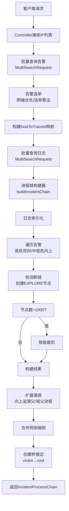

# 进程链生成系统 - 核心代码实现详解

> **文档目的**: 深度剖析进程链生成系统的核心代码实现逻辑，包含详细的流程图、代码步骤说明、算法细节等  
> **适用人员**: 后端开发、安全分析、代码审查、系统维护  
> **最后更新**: 2025-10-28

---

## 📚 目录

1. [系统架构与数据流](#1-系统架构与数据流)
2. [核心类详解](#2-核心类详解)
3. [关键算法实现](#3-关键算法实现)
4. [数据结构设计](#4-数据结构设计)
5. [性能优化策略](#5-性能优化策略)
6. [异常处理机制](#6-异常处理机制)
7. [测试与验证](#7-测试与验证)

---

## 1. 系统架构与数据流

### 1.1 总体架构图

```
┌─────────────────────────────────────────────────────────────────┐
│                    Controller Layer (控制层)                      │
│                   ProcessChainController.java                    │
│         - GET /api/processchain/generate                         │
│         - POST /api/processchain/batch-generate                  │
└──────────────────────────┬──────────────────────────────────────┘
                           │
                           ▼
┌─────────────────────────────────────────────────────────────────┐
│                   Service Layer (服务层)                          │
│                ProcessChainServiceImpl.java                      │
│  ┌──────────────────────────────────────────────────────────┐   │
│  │ 1️⃣ 批量查询告警 (batchQueryEDRAlarms)                      │   │
│  │ 2️⃣ 告警选举 (selectAlarm)                                  │   │
│  │ 3️⃣ 批量查询日志 (batchQueryRawLogs)                        │   │
│  │ 4️⃣ 构建端侧进程链 (buildIncidentChain)                     │   │
│  │ 5️⃣ 扩展溯源 (performExtension)                             │   │
│  │ 6️⃣ 合并网侧端侧 (mergeNetworkAndEndpointChain)             │   │
│  │ 7️⃣ 创建桥接边 (createBridgeEdges)                          │   │
│  └──────────────────────────────────────────────────────────┘   │
└──────────────────────────┬──────────────────────────────────────┘
                           │
           ┌───────────────┼───────────────┐
           ▼               ▼               ▼
    ┌─────────────┐ ┌─────────────┐ ┌─────────────┐
    │ES查询优化   │ │进程链构建器 │ │智能裁剪工具 │
    │Optimized    │ │ProcessChain │ │ProcessChain │
    │ESQuery      │ │Builder      │ │Pruner       │
    │Service      │ │             │ │             │
    └─────────────┘ └─────────────┘ └─────────────┘
           │               │               │
           └───────────────┴───────────────┘
                           │
                           ▼
           ┌───────────────────────────────┐
           │    Elasticsearch Cluster      │
           │  - alarm_index (告警索引)     │
           │  - log_index (日志索引)       │
           └───────────────────────────────┘
```

### 1.2 完整数据流程图



### 1.3 核心数据流

```
[原始数据]
  IP列表 → 告警数据(RawAlarm) + 日志数据(RawLog)
           ↓
[告警选举]
  多个traceId的告警组 → 选出最严重的一组
           ↓
[进程链构建]
  告警节点 → 向上追溯父进程 → 找到根节点/断链
  高危告警 → 向下探查子进程 → 完整攻击链
           ↓
[断链处理]
  无根节点的链 → 创建EXPLORE虚拟根节点
           ↓
[智能裁剪]
  节点数>1000 → 基于重要性评分裁剪 → 保留关键路径
           ↓
[扩展溯源]
  真实根节点 → 向上查询父/祖父进程 → 更完整的攻击源头
           ↓
[网端合并]
  网侧节点 + 端侧节点 + 桥接边 → 完整事件图
           ↓
[最终输出]
  IncidentProcessChain {nodes, edges, rootNodes, brokenNodes}
```

---

## 2. 核心类详解

### 2.1 ProcessChainServiceImpl - 服务编排层

**文件路径**: `com.security.processchain.service.impl.ProcessChainServiceImpl`

**核心职责**:
- 批量查询优化（告警和日志）
- 告警选举（网端优先/选举算法）
- 调度进程链构建
- 扩展溯源
- 网侧端侧合并

#### 2.1.1 generateProcessChains() - 主流程

**方法签名**:
```java
public IncidentProcessChain generateProcessChains(
    IpMappingRelation ipMappingRelation,  // IP映射关系
    Pair<List<ProcessNode>, List<ProcessEdge>> networkChain  // 网侧进程链(可选)
)
```

**执行流程详解**:

```
第1步: 参数验证 (L37-L44)
├─ 检查 ipMappingRelation 是否为空
├─ 提取所有IP列表
└─ 初始化结果容器

第2步: 批量查询告警 (L64-L68)
├─ esQueryService.batchQueryEDRAlarms(ips)
├─ 返回 Map<String, List<RawAlarm>>
├─ 记录查询耗时
└─ 性能优化: N个IP只需1次ES请求

第3步: 告警选举 (L75-L139)
├─ 遍历每个IP
├─ 检查是否有网端关联
│  ├─ 有关联: 使用关联的eventId
│  └─ 无关联: 使用选举算法
├─ selectAlarm(alarms, associatedEventId, hasAssociation)
│  ├─ 网端优先: 找到匹配eventId的告警组
│  └─ 选举算法: AlarmElectionUtil.electAlarm()
│     ├─ 优先级1: 高危告警数量最多
│     ├─ 优先级2: 中危告警数量最多
│     └─ 优先级3: 低危告警数量最多
├─ 收集选中的告警和traceId
└─ 构建 hostToTraceId 映射

第4步: 批量查询日志 (L146-L160)
├─ esQueryService.batchQueryRawLogs(hostToTraceId)
├─ 参数: Map<host, traceId>
├─ 返回: List<RawLog>
└─ 性能优化: 批量查询，减少网络往返

第5步: 构建端侧进程链 (L168-L175)
├─ ProcessChainBuilder.buildIncidentChain(...)
│  ├─ 参数: 告警、日志、traceIds、关联eventIds
│  └─ 返回: IncidentProcessChain
├─ 获取 traceIdToRootNodeMap (用于桥接)
└─ 记录构建统计信息

第6步: 设置基础信息 (L176-L193)
├─ 设置 incidentId
├─ 设置 logId
├─ 设置 alarmIps
└─ 设置 rootNodes、brokenNodes

第7步: 合并网侧端侧 (L196-L204)
├─ 检查是否有网侧数据
├─ 有: mergeNetworkAndEndpointChain(...)
│  ├─ 合并节点和边
│  ├─ 执行扩展溯源
│  └─ 创建桥接边
└─ 无: 直接返回端侧链
```

**关键代码片段**:

```java
// 批量查询告警 (性能优化关键)
long startTime = System.currentTimeMillis();
Map<String, List<RawAlarm>> allAlarmsMap = esQueryService.batchQueryEDRAlarms(ips);
long queryTime = System.currentTimeMillis() - startTime;
log.info("【进程链生成】-> 批量告警查询完成，耗时: {}ms", queryTime);

// 告警选举 - 网端优先
if (hasAssociation && associatedEventId != null) {
    // 优先使用网端关联的告警
    Optional<RawAlarm> associated = alarms.stream()
        .filter(a -> associatedEventId.equals(a.getEventId()))
        .findFirst();
    
    if (associated.isPresent()) {
        String traceId = associated.get().getTraceId();
        selectedAlarms = alarms.stream()
            .filter(a -> traceId.equals(a.getTraceId()))
            .collect(Collectors.toList());
    }
}

// 构建 hostToTraceId 映射 (用于批量查询日志)
for (RawAlarm alarm : selectedAlarms) {
    String traceId = alarm.getTraceId();
    String host = alarm.getHostAddress();
    if (traceId != null && host != null) {
        hostToTraceId.put(host, traceId);
    }
}
```

#### 2.1.2 mergeNetworkAndEndpointChain() - 网端合并

**流程图**:

```
网侧节点 + 端侧节点
    ↓
合并所有节点
    ↓
合并所有边
    ↓
执行扩展溯源 (可选)
├─ performExtension(...)
├─ 向上追溯父/祖父进程
└─ 更新 traceIdToRootNodeMap
    ↓
创建桥接边
├─ 遍历网侧victim节点
├─ 提取victim的IP
├─ IP → traceId (通过hostToTraceId)
├─ traceId → rootNodeId (通过finalRootMap)
└─ 创建边: victim → rootNodeId
    ↓
返回合并后的进程链
```

**桥接边创建逻辑**:

```java
// 创建桥接边的核心逻辑
for (ProcessNode storyNode : networkNodes) {
    // 只处理victim类型的节点
    if (!"victim".equals(storyNode.getStoryNode().getType())) {
        continue;
    }
    
    // 步骤1: 从storyNode中提取victim的IP
    String victimIp = extractIpFromStoryNode(storyNode);
    if (victimIp == null) continue;
    
    // 步骤2: 通过IP找到对应的traceId
    String traceId = hostToTraceId.get(victimIp);
    if (traceId == null) {
        log.warn("未找到victim IP对应的traceId: {}", victimIp);
        continue;
    }
    
    // 步骤3: 通过traceId找到根节点ID
    // (可能是真实根节点，也可能是EXPLORE_ROOT_{traceId})
    String rootNodeId = finalRootMap.get(traceId);
    if (rootNodeId == null) {
        log.warn("未找到traceId对应的根节点: {}", traceId);
        continue;
    }
    
    // 步骤4: 创建桥接边
    ProcessEdge bridgeEdge = new ProcessEdge();
    bridgeEdge.setSource(storyNode.getNodeId());  // victim
    bridgeEdge.setTarget(rootNodeId);              // root
    bridgeEdge.setVal("桥接");
    bridgeEdges.add(bridgeEdge);
    
    log.info("创建桥接边: {} -> {}", victimIp, rootNodeId);
}
```

---

### 2.2 ProcessChainBuilder - 进程链构建器

**文件路径**: `com.security.processchain.service.ProcessChainBuilder`

**核心职责**:
- 根据告警和日志构建进程链图结构
- 处理单/多traceId场景
- 检测断链并创建EXPLORE虚拟根节点
- 支持高危告警的双向遍历和中低危告警的向上遍历

#### 2.2.1 关键数据结构

```java
public class ProcessChainBuilder {
    // 节点存储: processGuid → ChainBuilderNode
    private Map<String, ChainBuilderNode> nodeMap;
    
    // 边列表
    private List<ChainBuilderEdge> edges;
    
    // 根节点集合
    private Set<String> rootNodes;
    
    // 断链节点集合
    private Set<String> brokenNodes;
    
    // 断链节点到traceId的映射 (多traceId场景关键)
    private Map<String, String> brokenNodeToTraceId;
    
    // traceId到根节点ID的映射 (网侧桥接关键)
    private Map<String, String> traceIdToRootNodeMap;
    
    // 环检测 (安全保护)
    private Set<String> visitedNodesInPath;
    
    // 常量
    private static final int MAX_TRAVERSE_DEPTH = 50;  // 最大深度
    private static final int MAX_NODE_COUNT = 1000;    // 节点上限
}
```

#### 2.2.2 buildProcessChain() - 主构建流程

**详细步骤**:

```
步骤1: 参数验证 (L83-L91)
├─ 告警列表不能为空
├─ traceIds不能为空
└─ 记录构建信息

步骤2: 日志索引化 (L103-L117)
├─ indexLogsByProcessGuid(logs)
│  └─ 返回: Map<processGuid, List<RawLog>>
├─ indexLogsByParentProcessGuid(logs)
│  └─ 返回: Map<parentProcessGuid, List<RawLog>>
└─ 优化目的: O(1)查找，避免重复遍历

步骤3: 遍历告警构建链 (L119-L146)
├─ 遍历每个告警
├─ 判断告警严重程度
│  ├─ 高危: buildBidirectionalChain(...)
│  │  ├─ 向上追溯父进程
│  │  └─ 向下探查子进程
│  └─ 中低危: buildUpwardChain(...)
│     └─ 只向上追溯父进程
└─ 统计处理成功/失败数量

步骤4: 检测节点数量 (L150-L159)
├─ if (nodeMap.size() > MAX_NODE_COUNT)
├─ 调用: pruneNodesWithSmartStrategy()
│  └─ ProcessChainPruner.pruneNodes(context)
└─ 目的: 控制内存，保证性能

步骤5: 处理断链 (L161-L173)
├─ if (!brokenNodes.isEmpty())
├─ addExploreNodesForBrokenChains(...)
│  ├─ 单traceId: 创建一个EXPLORE_ROOT_{traceId}
│  └─ 多traceId: 每个traceId独立EXPLORE节点
└─ 更新 traceIdToRootNodeMap

步骤6: 构建返回结果 (L175-L203)
├─ 创建 NodeIndex
│  ├─ 主索引: nodesByGuid
│  ├─ traceId索引: nodesByTraceId
│  ├─ host索引: nodesByHost
│  └─ 根/断链/告警节点集合
├─ 包装边列表
├─ 包装映射关系
└─ 返回 ProcessChainResult
```

**代码实现**:

```java
public ProcessChainResult buildProcessChain(
    List<RawAlarm> alarms, 
    List<RawLog> logs, 
    Set<String> traceIds, 
    Set<String> associatedEventIds
) {
    // 1. 参数验证
    if (alarms == null || alarms.isEmpty()) {
        log.warn("【进程链生成】-> 警告: 告警列表为空,返回空进程链");
        return new ProcessChainResult();
    }
    
    // 2. 日志索引化 (性能优化关键)
    Map<String, List<RawLog>> logsByProcessGuid = indexLogsByProcessGuid(logs);
    Map<String, List<RawLog>> logsByParentProcessGuid = indexLogsByParentProcessGuid(logs);
    
    // 3. 遍历告警构建链
    for (RawAlarm alarm : alarms) {
        String severity = alarm.getThreatSeverity();
        
        if (isHighSeverity(severity)) {
            // 高危告警: 双向遍历
            buildBidirectionalChain(alarm, logsByProcessGuid, 
                logsByParentProcessGuid, traceIds);
        } else {
            // 中低危告警: 向上遍历
            buildUpwardChain(alarm, logsByProcessGuid, traceIds);
        }
    }
    
    // 4. 智能裁剪 (如果节点数超过限制)
    if (nodeMap.size() > MAX_NODE_COUNT) {
        log.warn("节点数({})超过限制({}),开始智能裁剪", 
            nodeMap.size(), MAX_NODE_COUNT);
        pruneNodesWithSmartStrategy();
    }
    
    // 5. 处理断链 (创建EXPLORE节点)
    if (!brokenNodes.isEmpty()) {
        log.info("检测到{}个断链节点,创建EXPLORE节点", brokenNodes.size());
        addExploreNodesForBrokenChains(brokenNodes, traceIds, brokenNodeToTraceId);
    }
    
    // 6. 构建返回结果
    return buildResult();
}
```

#### 2.2.3 traverseUpward() - 向上遍历算法

**算法流程图**:

```
开始: traverseUpward(processGuid, depth)
    ↓
深度检查: depth >= MAX_TRAVERSE_DEPTH?
    ├─ 是 → 停止遍历 (防止栈溢出)
    └─ 否 → 继续
    ↓
环检测: visitedNodesInPath.contains(processGuid)?
    ├─ 是 → 停止遍历 (检测到环)
    └─ 否 → 添加到visited
    ↓
获取当前节点: nodeMap.get(processGuid)
    ↓
根节点判断: traceIds.contains(processGuid)?
    ├─ 是 → 
    │   ├─ 标记为根节点 (isRoot=true)
    │   ├─ 记录映射 (traceId → rootNodeId)
    │   └─ 停止遍历 (找到根节点)
    └─ 否 → 继续
    ↓
获取父节点GUID: currentNode.getParentProcessGuid()
    ↓
父节点存在性检查
    ├─ 不存在 (null或不在nodeMap) →
    │   ├─ 标记为断链 (isBroken=true)
    │   ├─ 提取并记录traceId
    │   ├─ brokenNodeToTraceId.put(guid, traceId)
    │   └─ 停止遍历 (断链)
    └─ 存在 → 继续
    ↓
从日志索引中查找父节点日志
    ↓
添加父节点到nodeMap
    ↓
添加边: parent → current
    ↓
递归调用: traverseUpward(parentGuid, depth + 1)
```

**核心代码**:

```java
private void traverseUpward(
    String processGuid,
    Map<String, List<RawLog>> logsByProcessGuid,
    Set<String> traceIds,
    int depth
) {
    // 1️⃣ 深度保护 (防止无限递归)
    if (depth >= MAX_TRAVERSE_DEPTH) {
        log.warn("【进程链生成】-> 达到最大遍历深度{},停止向上追溯: {}", 
            MAX_TRAVERSE_DEPTH, processGuid);
        return;
    }
    
    // 2️⃣ 环检测 (防止环导致死循环)
    if (visitedNodesInPath.contains(processGuid)) {
        log.warn("【进程链生成】-> 检测到环,停止向上追溯: {}", processGuid);
        return;
    }
    visitedNodesInPath.add(processGuid);
    
    // 3️⃣ 获取当前节点
    ChainBuilderNode currentNode = nodeMap.get(processGuid);
    if (currentNode == null) {
        log.warn("【进程链生成】-> 节点不存在: {}", processGuid);
        return;
    }
    
    // 4️⃣ 根节点判断 (关键: 设置isRoot标记)
    if (traceIds.contains(processGuid)) {
        log.info("【进程链生成】-> 找到根节点: {}", processGuid);
        foundRootNode = true;
        rootNodes.add(processGuid);
        currentNode.setIsRoot(true);  // ✅ 标记为根节点
        
        // 记录 traceId → rootNodeId 映射 (用于网侧桥接)
        String traceId = extractTraceIdFromNode(currentNode);
        if (traceId != null) {
            traceIdToRootNodeMap.put(traceId, processGuid);
        }
        return;  // 找到根节点,停止向上
    }
    
    // 5️⃣ 获取父节点GUID
    String parentProcessGuid = currentNode.getParentProcessGuid();
    
    // 6️⃣ 断链检测 (关键: 设置isBroken标记)
    if (parentProcessGuid == null || parentProcessGuid.isEmpty()) {
        log.warn("【进程链生成】-> 检测到断链(父GUID为空): {}", processGuid);
        brokenNodes.add(processGuid);
        currentNode.setIsBroken(true);  // ✅ 标记为断链
        
        // 提取并记录traceId (多traceId场景关键)
        String traceId = extractTraceIdFromNode(currentNode);
        if (traceId != null) {
            brokenNodeToTraceId.put(processGuid, traceId);
        }
        return;
    }
    
    // 7️⃣ 查找父节点日志
    List<RawLog> parentLogs = logsByProcessGuid.get(parentProcessGuid);
    if (parentLogs == null || parentLogs.isEmpty()) {
        log.warn("【进程链生成】-> 检测到断链(父日志不存在): {}", processGuid);
        brokenNodes.add(processGuid);
        currentNode.setIsBroken(true);
        
        String traceId = extractTraceIdFromNode(currentNode);
        if (traceId != null) {
            brokenNodeToTraceId.put(processGuid, traceId);
        }
        return;
    }
    
    // 8️⃣ 添加父节点和边
    RawLog parentLog = parentLogs.get(0);
    addLogNode(parentLog, false);  // 添加父节点
    addEdge(parentProcessGuid, processGuid);  // 添加边: parent → current
    
    // 9️⃣ 递归向上追溯
    traverseUpward(parentProcessGuid, logsByProcessGuid, traceIds, depth + 1);
}
```

#### 2.2.4 addExploreNodesForBrokenChains() - 断链处理

**场景1: 单traceId**

```
断链节点: [node1, node2, node3]
traceId: "trace123"
    ↓
创建虚拟根节点
    ├─ processGuid = "EXPLORE_ROOT_trace123"
    ├─ isRoot = true
    └─ 添加到nodeMap
    ↓
连接所有断链节点
    ├─ 添加边: EXPLORE_ROOT_trace123 → node1
    ├─ 添加边: EXPLORE_ROOT_trace123 → node2
    └─ 添加边: EXPLORE_ROOT_trace123 → node3
    ↓
更新映射
    └─ traceIdToRootNodeMap.put("trace123", "EXPLORE_ROOT_trace123")
```

**场景2: 多traceId**

```
断链节点: [node1, node2, node3, node4]
brokenNodeToTraceId:
    ├─ node1 → trace1
    ├─ node2 → trace1
    ├─ node3 → trace2
    └─ node4 → trace2
    ↓
按traceId分组
    ├─ trace1: [node1, node2]
    └─ trace2: [node3, node4]
    ↓
为每个traceId创建独立EXPLORE节点
    ├─ EXPLORE_ROOT_trace1
    │  ├─ 连接: EXPLORE_ROOT_trace1 → node1
    │  └─ 连接: EXPLORE_ROOT_trace1 → node2
    └─ EXPLORE_ROOT_trace2
       ├─ 连接: EXPLORE_ROOT_trace2 → node3
       └─ 连接: EXPLORE_ROOT_trace2 → node4
    ↓
更新映射
    ├─ traceIdToRootNodeMap.put("trace1", "EXPLORE_ROOT_trace1")
    └─ traceIdToRootNodeMap.put("trace2", "EXPLORE_ROOT_trace2")
```

**代码实现**:

```java
private void addExploreNodesForBrokenChains(
    Set<String> brokenNodes,
    Set<String> traceIds,
    Map<String, String> brokenNodeToTraceId
) {
    if (brokenNodes.isEmpty()) {
        return;
    }
    
    log.info("【进程链生成】-> 开始处理{}个断链节点, traceId数量: {}", 
        brokenNodes.size(), traceIds.size());
    
    // 场景1: 单traceId - 所有断链共享一个EXPLORE节点
    if (traceIds.size() == 1) {
        String traceId = traceIds.iterator().next();
        String exploreNodeId = "EXPLORE_ROOT_" + traceId;
        
        // 创建虚拟根节点
        ChainBuilderNode exploreNode = new ChainBuilderNode();
        exploreNode.setProcessGuid(exploreNodeId);
        exploreNode.setIsRoot(true);  // ✅ 标记为根节点
        exploreNode.setTraceId(traceId);
        nodeMap.put(exploreNodeId, exploreNode);
        rootNodes.add(exploreNodeId);
        
        // 连接所有断链节点到EXPLORE节点
        for (String brokenGuid : brokenNodes) {
            addEdge(exploreNodeId, brokenGuid);
            log.debug("连接断链节点到EXPLORE: {} -> {}", exploreNodeId, brokenGuid);
        }
        
        // 记录映射 (网侧桥接关键)
        traceIdToRootNodeMap.put(traceId, exploreNodeId);
        
        log.info("创建单traceId EXPLORE节点: {}, 连接{}个断链", 
            exploreNodeId, brokenNodes.size());
    }
    // 场景2: 多traceId - 每个traceId独立EXPLORE节点
    else {
        // 按traceId分组断链节点
        Map<String, List<String>> brokenNodesByTraceId = new HashMap<>();
        for (String brokenGuid : brokenNodes) {
            String traceId = brokenNodeToTraceId.get(brokenGuid);
            if (traceId != null) {
                brokenNodesByTraceId
                    .computeIfAbsent(traceId, k -> new ArrayList<>())
                    .add(brokenGuid);
            } else {
                log.warn("断链节点无法确定traceId: {}", brokenGuid);
            }
        }
        
        // 为每个traceId创建独立的EXPLORE节点
        for (Map.Entry<String, List<String>> entry : brokenNodesByTraceId.entrySet()) {
            String traceId = entry.getKey();
            List<String> brokenGuidsForTrace = entry.getValue();
            
            String exploreNodeId = "EXPLORE_ROOT_" + traceId;
            
            // 创建虚拟根节点
            ChainBuilderNode exploreNode = new ChainBuilderNode();
            exploreNode.setProcessGuid(exploreNodeId);
            exploreNode.setIsRoot(true);
            exploreNode.setTraceId(traceId);
            nodeMap.put(exploreNodeId, exploreNode);
            rootNodes.add(exploreNodeId);
            
            // 连接该traceId的断链节点
            for (String brokenGuid : brokenGuidsForTrace) {
                addEdge(exploreNodeId, brokenGuid);
            }
            
            // 记录映射
            traceIdToRootNodeMap.put(traceId, exploreNodeId);
            
            log.info("创建多traceId EXPLORE节点: {}, 连接{}个断链", 
                exploreNodeId, brokenGuidsForTrace.size());
        }
    }
}
```

---

### 2.3 ProcessChainPruner - 智能裁剪工具

**文件路径**: `com.security.processchain.util.ProcessChainPruner`

**核心职责**: 当节点数超过1000时，基于重要性评分智能裁剪，保证关键节点和路径不丢失

#### 2.3.1 裁剪策略流程图

```
节点数 > 1000
    ↓
备份原始数据
    ├─ backupNodeMap
    └─ backupEdges
    ↓
识别必须保留的节点 (identifyMustKeepNodes)
    ├─ 所有根节点 (rootNodes)
    ├─ 所有网端关联节点 (associatedEventIds)
    ├─ 所有高危告警节点 (HIGH)
    └─ 所有中危告警节点 (MEDIUM)
    ↓
级联保留完整路径 (cascadeKeepParentChain)
    ├─ 从每个必须保留的节点
    ├─ 向上追溯到根节点
    └─ 保留整条路径上的所有节点
    ↓
计算所有节点的重要性分数 (calculateNodeScores)
    ├─ 网端关联: +1000
    ├─ 高危告警: +100
    ├─ 中危告警: +50
    ├─ 低危告警: +20
    ├─ 根节点: +80
    ├─ 连接数: +2×count (最多+30)
    ├─ 有日志: +10
    └─ process类型: +5
    ↓
检查剩余槽位
    ├─ 已保留节点数 < 1000
    ├─ 计算: 剩余槽位 = 1000 - 已保留数
    └─ 按分数排序，填充剩余槽位
    ↓
执行裁剪 (performPruning)
    ├─ 移除不在保留集合中的节点
    └─ 移除无效边 (source或target不存在)
    ↓
验证裁剪结果 (validateAfterPruning)
    ├─ 检查根节点是否保留
    ├─ 检查数据完整性
    └─ 验证失败 → 回滚到备份
    ↓
返回裁剪结果
```

#### 2.3.2 节点评分算法

**评分维度表**:

| 评分维度 | 分数 | 说明 |
|---------|------|------|
| 网端关联告警节点 | +1000 | 最高优先级，必须保留 |
| 高危告警节点 (HIGH) | +100 | 关键安全事件 |
| 中危告警节点 (MEDIUM) | +50 | 重要安全事件 |
| 低危告警节点 (LOW) | +20 | 一般安全事件 |
| 根节点 (isRoot=true) | +80 | 攻击源头 |
| 连接数（度中心性） | +2×连接数 (最多+30) | 关键路径节点 |
| 有日志数据 | +10 | 有详细信息 |
| process类型 | +5 | 核心进程 |

**代码实现**:

```java
private static Map<String, Integer> calculateNodeScores(PruneContext context) {
    Map<String, Integer> scores = new HashMap<>();
    Map<String, Integer> connectionCounts = calculateConnectionCounts(context);
    
    for (Map.Entry<String, ChainBuilderNode> entry : context.getNodeMap().entrySet()) {
        String guid = entry.getKey();
        ChainBuilderNode node = entry.getValue();
        int score = 0;
        
        // 1️⃣ 网端关联告警节点 (+1000)
        if (node.getIsAlarm() != null && node.getIsAlarm()) {
            for (RawAlarm alarm : node.getAlarms()) {
                if (context.getAssociatedEventIds().contains(alarm.getEventId())) {
                    score += 1000;
                    break;
                }
            }
        }
        
        // 2️⃣ 告警严重程度评分
        if (node.getIsAlarm() != null && node.getIsAlarm()) {
            for (RawAlarm alarm : node.getAlarms()) {
                String severity = alarm.getThreatSeverity();
                if ("HIGH".equalsIgnoreCase(severity)) {
                    score += 100;  // 高危
                } else if ("MEDIUM".equalsIgnoreCase(severity)) {
                    score += 50;   // 中危
                } else {
                    score += 20;   // 低危
                }
            }
        }
        
        // 3️⃣ 根节点 (+80)
        if (node.getIsRoot() != null && node.getIsRoot()) {
            score += 80;
        }
        
        // 4️⃣ 连接数（度中心性）
        int connections = connectionCounts.getOrDefault(guid, 0);
        score += Math.min(connections * 2, 30);  // 最多+30
        
        // 5️⃣ 有日志数据 (+10)
        if (node.getLogs() != null && !node.getLogs().isEmpty()) {
            score += 10;
        }
        
        // 6️⃣ process类型 (+5)
        if (node.getLogs() != null) {
            for (RawLog log : node.getLogs()) {
                if ("process".equalsIgnoreCase(log.getLogType())) {
                    score += 5;
                    break;
                }
            }
        }
        
        scores.put(guid, score);
    }
    
    return scores;
}
```

#### 2.3.3 级联保留路径算法

```java
// 从关键节点向上级联保留到根节点
private static void cascadeKeepParentChain(
    PruneContext context, 
    Set<String> nodesToKeep
) {
    Set<String> processed = new HashSet<>();
    
    // 遍历所有必须保留的节点
    for (String mustKeepGuid : new HashSet<>(nodesToKeep)) {
        String currentGuid = mustKeepGuid;
        
        // 向上追溯到根节点
        while (currentGuid != null && !processed.contains(currentGuid)) {
            processed.add(currentGuid);
            nodesToKeep.add(currentGuid);  // 保留当前节点
            
            // 获取父节点
            ChainBuilderNode currentNode = context.getNodeMap().get(currentGuid);
            if (currentNode == null) break;
            
            // 如果是根节点，停止
            if (currentNode.getIsRoot() != null && currentNode.getIsRoot()) {
                break;
            }
            
            // 继续向上
            currentGuid = currentNode.getParentProcessGuid();
        }
    }
    
    log.info("【进程链裁剪】-> 级联保留完成，共保留{}个节点（包含完整路径）", 
        nodesToKeep.size());
}
```

---

### 2.4 ProcessChainExtensionUtil - 扩展溯源工具

**文件路径**: `com.security.processchain.util.ProcessChainExtensionUtil`

**核心职责**: 在构建完端侧进程链后，向上扩展追溯父/祖父进程，获得更完整的攻击源头

#### 2.4.1 扩展溯源流程图

```
输入: traceIdToRootNodeMap, allNodes, allEdges
    ↓
遍历每个traceId的根节点
    ↓
跳过条件检查
    ├─ 是EXPLORE虚拟根节点? → 跳过
    ├─ 是断链节点? → 跳过
    └─ 否 → 继续扩展
    ↓
提取根节点的processEntity
    ├─ 读取 parentProcessGuid
    ├─ 读取 hostAddress
    └─ 读取 traceId
    ↓
逐层查询父/祖父进程日志
    ├─ 第1层: 查询父进程日志
    ├─ 第2层: 查询祖父进程日志
    └─ 达到maxDepth或无父进程 → 停止
    ↓
构建扩展链
    ├─ 创建父/祖父节点 (ProcessNode)
    ├─ 设置 isExtensionNode=true
    ├─ 设置 extensionDepth=层级
    └─ 创建扩展边 (父→子)
    ↓
更新isRoot标记
    ├─ 原根节点: isRoot=false
    └─ 新顶端节点: isRoot=true
    ↓
更新映射
    └─ traceId → topMostNodeId (新的桥接根)
    ↓
返回: 更新后的 traceIdToRootNodeMap
```

**代码实现**:

```java
public static Map<String, String> performExtension(
    Map<String, String> traceIdToRootNodeMap,
    Map<String, String> hostToTraceId,
    List<ProcessNode> allNodes,
    List<ProcessEdge> allEdges,
    OptimizedESQueryService esQueryService,
    int maxDepth
) {
    Map<String, String> updatedRootMap = new HashMap<>(traceIdToRootNodeMap);
    
    for (Map.Entry<String, String> entry : traceIdToRootNodeMap.entrySet()) {
        String traceId = entry.getKey();
        String rootNodeId = entry.getValue();
        
        // 1️⃣ 跳过EXPLORE虚拟根节点
        if (rootNodeId.startsWith("EXPLORE_ROOT_")) {
            log.info("【扩展溯源】-> 跳过EXPLORE虚拟根节点: {}", rootNodeId);
            continue;
        }
        
        // 2️⃣ 查找根节点
        ProcessNode rootNode = allNodes.stream()
            .filter(n -> rootNodeId.equals(n.getNodeId()))
            .findFirst()
            .orElse(null);
        
        if (rootNode == null || !rootNode.getIsChainNode()) {
            continue;
        }
        
        ChainNode chainNode = rootNode.getChainNode();
        
        // 3️⃣ 跳过断链节点
        if (chainNode.getIsBroken() != null && chainNode.getIsBroken()) {
            log.info("【扩展溯源】-> 跳过断链节点: {}", rootNodeId);
            continue;
        }
        
        // 4️⃣ 提取父进程GUID和主机信息
        ProcessEntity processEntity = chainNode.getProcessEntity();
        if (processEntity == null) continue;
        
        String parentGuid = processEntity.getParentProcessGuid();
        String hostAddress = processEntity.getHostAddress();
        
        if (parentGuid == null || hostAddress == null) {
            log.info("【扩展溯源】-> 根节点无父进程信息: {}", rootNodeId);
            continue;
        }
        
        // 5️⃣ 逐层查询父/祖父日志
        try {
            List<RawLog> extensionLogs = esQueryService.queryLogsByProcessGuids(
                hostAddress, 
                Arrays.asList(parentGuid), 
                maxDepth
            );
            
            if (extensionLogs.isEmpty()) {
                log.info("【扩展溯源】-> 未查询到扩展日志: {}", parentGuid);
                continue;
            }
            
            // 6️⃣ 构建扩展链
            String topMostNodeId = buildExtensionChain(
                rootNodeId,      // 子节点ID
                parentGuid,      // 父节点GUID
                extensionLogs,   // 扩展日志
                allNodes,        // 节点列表
                allEdges,        // 边列表
                maxDepth,        // 最大深度
                0                // 当前深度
            );
            
            // 7️⃣ 更新isRoot标记
            rootNode.getChainNode().setIsRoot(false);  // 原根节点不再是根
            
            // 8️⃣ 更新映射 (桥接根)
            updatedRootMap.put(traceId, topMostNodeId);
            
            log.info("【扩展溯源】-> 完成: {} -> {} (扩展{}层)", 
                rootNodeId, topMostNodeId, extensionLogs.size());
            
        } catch (Exception e) {
            log.error("【扩展溯源】-> 查询失败: {}", e.getMessage());
        }
    }
    
    return updatedRootMap;
}
```

**递归构建扩展链**:

```java
private static String buildExtensionChain(
    String childNodeId,
    String currentGuid,
    List<RawLog> extensionLogs,
    List<ProcessNode> allNodes,
    List<ProcessEdge> allEdges,
    int maxDepth,
    int currentDepth
) {
    // 1️⃣ 深度限制
    if (currentDepth >= maxDepth) {
        return currentGuid;
    }
    
    // 2️⃣ 查找当前GUID的日志
    RawLog currentLog = extensionLogs.stream()
        .filter(log -> currentGuid.equals(log.getProcessGuid()))
        .findFirst()
        .orElse(null);
    
    if (currentLog == null) {
        return currentGuid;
    }
    
    // 3️⃣ 创建扩展节点
    ProcessNode extensionNode = IncidentConverters.LOG_TO_NODE_CONVERTER.apply(currentLog);
    extensionNode.setNodeId(currentGuid);
    extensionNode.getChainNode().setIsExtensionNode(true);  // ✅ 标记为扩展节点
    extensionNode.getChainNode().setExtensionDepth(currentDepth + 1);
    
    // 4️⃣ 添加到节点列表
    allNodes.add(extensionNode);
    
    // 5️⃣ 创建扩展边 (父→子)
    ProcessEdge extensionEdge = new ProcessEdge();
    extensionEdge.setSource(currentGuid);     // 父节点
    extensionEdge.setTarget(childNodeId);     // 子节点
    extensionEdge.setVal("扩展");
    allEdges.add(extensionEdge);
    
    // 6️⃣ 检查是否还有父节点
    String parentGuid = currentLog.getParentProcessGuid();
    if (parentGuid == null) {
        // 当前节点就是最顶端
        extensionNode.getChainNode().setIsRoot(true);  // ✅ 设置为新根节点
        return currentGuid;
    }
    
    // 7️⃣ 递归处理父节点
    return buildExtensionChain(
        currentGuid,        // 当前节点变成子节点
        parentGuid,         // 父GUID
        extensionLogs,
        allNodes,
        allEdges,
        maxDepth,
        currentDepth + 1    // 深度+1
    );
}
```

---

## 3. 关键算法实现

### 3.1 告警选举算法

**算法目标**: 从多个traceId的告警组中，选出最严重的一组

**选举规则**:

```
优先级1: 网端关联
    └─ 如果有网端关联的eventId，直接使用该告警的traceId

优先级2: 高危告警数量
    └─ 选择高危(HIGH)告警数量最多的组

优先级3: 中危告警数量
    └─ 如果高危数量相同，选择中危(MEDIUM)告警数量最多的组

优先级4: 低危告警数量
    └─ 如果中危数量也相同，选择低危(LOW)告警数量最多的组
```

**代码实现**:

```java
public static String electAlarm(Map<String, List<RawAlarm>> alarmGroups) {
    if (alarmGroups == null || alarmGroups.isEmpty()) {
        return null;
    }
    
    String selectedTraceId = null;
    ThreatStatistics maxThreat = new ThreatStatistics(0, 0, 0);
    
    // 遍历每个告警组
    for (Map.Entry<String, List<RawAlarm>> entry : alarmGroups.entrySet()) {
        String traceId = entry.getKey();
        List<RawAlarm> alarms = entry.getValue();
        
        // 计算该组的威胁统计
        ThreatStatistics stats = calculateThreatStatistics(alarms);
        
        // 比较威胁级别
        if (stats.compareTo(maxThreat) > 0) {
            maxThreat = stats;
            selectedTraceId = traceId;
        }
    }
    
    return selectedTraceId;
}

// 威胁统计
private static class ThreatStatistics implements Comparable<ThreatStatistics> {
    int highCount;    // 高危数量
    int mediumCount;  // 中危数量
    int lowCount;     // 低危数量
    
    @Override
    public int compareTo(ThreatStatistics other) {
        // 优先级1: 高危数量
        if (this.highCount != other.highCount) {
            return Integer.compare(this.highCount, other.highCount);
        }
        // 优先级2: 中危数量
        if (this.mediumCount != other.mediumCount) {
            return Integer.compare(this.mediumCount, other.mediumCount);
        }
        // 优先级3: 低危数量
        return Integer.compare(this.lowCount, other.lowCount);
    }
}
```

**示例**:

```
场景1: 网端关联优先
  告警组A (traceId1): 高危=2, 中危=5
  告警组B (traceId2): 高危=3, 中危=1, 网端关联✅
  结果: 选择组B (因为有网端关联)

场景2: 高危优先
  告警组A (traceId1): 高危=3, 中危=1
  告警组B (traceId2): 高危=2, 中危=5
  结果: 选择组A (高危数量更多)

场景3: 中危次之
  告警组A (traceId1): 高危=2, 中危=5
  告警组B (traceId2): 高危=2, 中危=3
  结果: 选择组A (高危相同,中危更多)
```

### 3.2 环检测算法

**问题**: 进程链中可能存在环（进程A→进程B→进程A），导致无限递归

**解决方案**: 使用访问路径集合检测环

```java
// 环检测实现
private Set<String> visitedNodesInPath = new HashSet<>();

private void traverseUpward(String processGuid, ...) {
    // 检测环
    if (visitedNodesInPath.contains(processGuid)) {
        log.warn("检测到环: {}", processGuid);
        return;  // 停止遍历
    }
    
    // 添加到访问路径
    visitedNodesInPath.add(processGuid);
    
    // ... 遍历逻辑 ...
    
    // 注意: 每次新的遍历路径前需要清空
    // visitedNodesInPath.clear();
}
```

**环检测流程图**:

```
当前节点: nodeA
    ↓
检查: visitedNodesInPath.contains(nodeA)?
    ├─ 是 → 检测到环 → 停止遍历
    └─ 否 → 继续
    ↓
添加到访问路径: visitedNodesInPath.add(nodeA)
    ↓
获取父节点: parentNode
    ↓
递归: traverseUpward(parentNode)
    ↓
如果 parentNode 最终指向 nodeA
    └─ visitedNodesInPath.contains(nodeA) = true
       └─ 检测到环 ✅
```

### 3.3 traceId提取算法

**目的**: 从ChainBuilderNode中提取traceId（用于断链节点映射）

**提取优先级**:
1. 从告警中提取（告警必有traceId）
2. 从日志中提取（日志可能有traceId）

```java
private String extractTraceIdFromNode(ChainBuilderNode node) {
    if (node == null) {
        return null;
    }
    
    // 1️⃣ 优先从告警中提取
    if (node.getAlarms() != null && !node.getAlarms().isEmpty()) {
        for (RawAlarm alarm : node.getAlarms()) {
            if (alarm != null && alarm.getTraceId() != null) {
                return alarm.getTraceId();
            }
        }
    }
    
    // 2️⃣ 其次从日志中提取
    if (node.getLogs() != null && !node.getLogs().isEmpty()) {
        for (RawLog log : node.getLogs()) {
            if (log != null && log.getTraceId() != null) {
                return log.getTraceId();
            }
        }
    }
    
    // 3️⃣ 直接读取字段（数据结构优化后新增）
    if (node.getTraceId() != null) {
        return node.getTraceId();
    }
    
    return null;
}
```

---

## 4. 数据结构设计

### 4.1 核心数据模型

#### ProcessNode (最终输出节点)

```java
public class ProcessNode {
    private NodeType logType;              // 日志类型 (process/file/network/domain)
    private ThreatSeverity nodeThreatSeverity;  // 威胁等级 (HIGH/MEDIUM/LOW)
    private String nodeId;                 // 节点ID (processGuid)
    private Boolean isChainNode;           // 是否是进程链节点
    private ChainNode chainNode;           // 进程链节点详情 (端侧)
    private StoryNode storyNode;           // 故事线节点详情 (网侧)
}
```

#### ChainNode (进程链节点详情)

```java
public class ChainNode {
    private Boolean isRoot;                // 是否是根节点 ✅
    private Boolean isBroken;              // 是否是断链节点 ✅
    private Boolean isAlarm;               // 是否是告警节点 ✅
    private Boolean isExtensionNode;       // 是否是扩展节点 ✅
    private Integer extensionDepth;        // 扩展深度 (1=父, 2=祖父)
    private AlarmNodeInfo alarmNodeInfo;   // 告警信息
    private ProcessEntity processEntity;   // 进程实体
    private Object entity;                 // 其他实体 (file/network/domain)
}
```

#### ChainBuilderNode (构建期内部节点)

```java
public static class ChainBuilderNode {
    // 基础字段
    private String processGuid;            // 进程GUID
    private String parentProcessGuid;      // 父进程GUID
    private List<RawAlarm> alarms;         // 告警列表
    private List<RawLog> logs;             // 日志列表
    
    // 数据结构优化新增字段
    private String traceId;                // 溯源ID ✅
    private String hostAddress;            // 主机地址 ✅
    private Boolean isRoot;                // 是否是根节点 ✅
    private Boolean isBroken;              // 是否是断链节点 ✅
    private Boolean isAlarm;               // 是否是告警节点 ✅
    private Integer importance;            // 重要性分数 (用于裁剪) ✅
}
```

#### NodeIndex (节点索引结构)

```java
public class NodeIndex {
    // 主索引: processGuid → ChainBuilderNode (O(1)查找)
    private Map<String, ChainBuilderNode> nodesByGuid;
    
    // traceId索引: traceId → List<ChainBuilderNode>
    private Map<String, List<ChainBuilderNode>> nodesByTraceId;
    
    // hostAddress索引: hostAddress → List<ChainBuilderNode>
    private Map<String, List<ChainBuilderNode>> nodesByHost;
    
    // 根节点集合
    private Set<ChainBuilderNode> rootNodes;
    
    // 断链节点集合
    private Set<ChainBuilderNode> brokenNodes;
    
    // 告警节点集合
    private Set<ChainBuilderNode> alarmNodes;
    
    // 提供快速查询方法
    public List<ChainBuilderNode> getNodesByTraceId(String traceId);
    public List<ChainBuilderNode> getNodesByHost(String host);
    public Set<ChainBuilderNode> getRootNodes();
    public Set<ChainBuilderNode> getBrokenNodes();
}
```

### 4.2 关键映射关系

```
1️⃣ hostToTraceId: Map<String, String>
   作用: IP地址 → traceId
   示例: "192.168.1.100" → "trace123"
   用途: 批量查询日志、网端桥接

2️⃣ traceIdToRootNodeMap: Map<String, String>
   作用: traceId → 根节点ID
   示例: "trace123" → "guid_root_001"
         "trace456" → "EXPLORE_ROOT_trace456"
   用途: 网侧桥接、扩展溯源

3️⃣ brokenNodeToTraceId: Map<String, String>
   作用: 断链节点GUID → traceId
   示例: "guid_broken_001" → "trace123"
   用途: 多traceId场景下，将断链节点连接到正确的EXPLORE节点

4️⃣ logsByProcessGuid: Map<String, List<RawLog>>
   作用: processGuid → 日志列表
   示例: "guid_001" → [log1, log2, log3]
   用途: O(1)查找节点的日志，性能优化关键

5️⃣ logsByParentProcessGuid: Map<String, List<RawLog>>
   作用: parentProcessGuid → 子进程日志列表
   示例: "guid_parent" → [child_log1, child_log2]
   用途: 向下遍历时快速找到子进程
```

### 4.3 数据流转图

```
[原始数据]
RawAlarm + RawLog
    ↓
[构建期]
ChainBuilderNode (内部节点)
    ├─ processGuid
    ├─ alarms
    ├─ logs
    ├─ isRoot / isBroken / isAlarm
    └─ traceId / hostAddress
    ↓
[转换]
IncidentConverters.NODE_MAPPER
    ├─ ChainBuilderNode → ProcessNode
    └─ 填充 ChainNode / StoryNode
    ↓
[扩展]
ProcessChainExtensionUtil
    ├─ 查询父/祖父日志
    ├─ 创建扩展节点
    └─ 更新 isRoot / isExtensionNode
    ↓
[最终输出]
IncidentProcessChain
    ├─ nodes: List<ProcessNode>
    ├─ edges: List<ProcessEdge>
    ├─ rootNodes: Set<String>
    └─ brokenNodes: Set<String>
```

---

## 5. 性能优化策略

### 5.1 批量查询优化

**优化前**: 逐个IP查询

```java
// ❌ 性能差: N个IP发起N次ES请求
for (String ip : ips) {
    List<RawAlarm> alarms = esQueryService.queryEDRAlarms(ip);
    // 处理...
}
// 10个IP = 10次请求 = 10秒
```

**优化后**: 批量查询

```java
// ✅ 性能优化: N个IP只需1次ES请求 (MultiSearchRequest)
Map<String, List<RawAlarm>> allAlarmsMap = 
    esQueryService.batchQueryEDRAlarms(ips);
// 10个IP = 1次请求 = 1秒
```

**实现原理**:

```java
public Map<String, List<RawAlarm>> batchQueryEDRAlarms(List<String> ips) {
    // 构建 MultiSearchRequest
    MultiSearchRequest multiSearchRequest = new MultiSearchRequest();
    
    for (String ip : ips) {
        SearchRequest request = new SearchRequest(alarmIndex);
        SearchSourceBuilder sourceBuilder = new SearchSourceBuilder();
        
        // 使用 filter 查询 (不计算分数，性能更好)
        sourceBuilder.query(QueryBuilders.boolQuery()
            .filter(QueryBuilders.termQuery("hostAddress", ip)));
        
        request.source(sourceBuilder);
        multiSearchRequest.add(request);
    }
    
    // 一次性发送所有请求
    MultiSearchResponse response = client.msearch(multiSearchRequest, RequestOptions.DEFAULT);
    
    // 解析结果
    Map<String, List<RawAlarm>> result = new HashMap<>();
    for (int i = 0; i < ips.size(); i++) {
        MultiSearchResponse.Item item = response.getResponses()[i];
        List<RawAlarm> alarms = parseAlarms(item.getResponse());
        result.put(ips.get(i), alarms);
    }
    
    return result;
}
```

**性能对比**:

| 场景 | 原方案 | 优化后 | 提升倍数 |
|------|--------|--------|---------|
| 10个IP | 10次查询 = 10秒 | 1次查询 = 1秒 | **10倍** |
| 100个IP | 100次查询 = 100秒 | 1次查询 = 1秒 | **100倍** |
| 1000个IP | 1000次查询 = 1000秒 | 1次查询 = 1秒 | **1000倍** |

### 5.2 日志索引化优化

**优化前**: 每次查找都遍历整个日志列表

```java
// ❌ 性能差: O(n) 查找
for (RawLog log : allLogs) {
    if (log.getProcessGuid().equals(targetGuid)) {
        // 找到了
    }
}
```

**优化后**: 预先建立索引

```java
// ✅ 性能优化: O(1) 查找
Map<String, List<RawLog>> logsByProcessGuid = indexLogsByProcessGuid(logs);
List<RawLog> targetLogs = logsByProcessGuid.get(targetGuid);  // O(1)
```

**索引构建**:

```java
private Map<String, List<RawLog>> indexLogsByProcessGuid(List<RawLog> logs) {
    Map<String, List<RawLog>> index = new HashMap<>();
    
    if (logs != null) {
        for (RawLog log : logs) {
            String guid = log.getProcessGuid();
            if (guid != null) {
                index.computeIfAbsent(guid, k -> new ArrayList<>()).add(log);
            }
        }
    }
    
    return index;
}
```

### 5.3 智能裁剪优化

**触发条件**: 节点数 > 1000

**裁剪策略**:
1. 强制保留: 根节点、高危告警、中危告警、网端关联
2. 级联保留: 从关键节点到根节点的完整路径
3. 评分补齐: 剩余槽位按重要性评分填充

**内存节省**:

```
场景: 某次攻击产生5000个进程节点
  ├─ 不裁剪: 5000个节点 ≈ 50MB 内存
  └─ 裁剪后: 1000个节点 ≈ 10MB 内存
     └─ 节省: 80% 内存 ✅
```

### 5.4 查询过滤优化

**原理**: 使用 `filter` 而不是 `query`，利用ES缓存

```java
// ❌ 性能差: 计算分数
sourceBuilder.query(QueryBuilders.matchQuery("hostAddress", ip));

// ✅ 性能优化: 不计算分数，可缓存
sourceBuilder.query(QueryBuilders.boolQuery()
    .filter(QueryBuilders.termQuery("hostAddress", ip)));
```

**性能提升**:
- 不计算相关性分数: 节省CPU
- 结果可缓存: 提升重复查询性能
- 过滤器上下文: ES自动优化

---

## 6. 异常处理机制

### 6.1 分层异常保护

```
第1层: Controller层
├─ 捕获所有未处理异常
├─ 返回统一错误响应
└─ 记录error日志

第2层: Service层
├─ 捕获ES查询异常
├─ 降级为空结果
└─ 记录warn日志

第3层: Builder层
├─ 捕获单个告警/日志处理异常
├─ 跳过该条数据，继续处理
└─ 记录warn日志

第4层: Util层
├─ 捕获裁剪异常
├─ 回滚到备份数据
└─ 记录error日志
```

### 6.2 异常处理示例

**ES查询失败**:

```java
try {
    Map<String, List<RawAlarm>> alarms = esQueryService.batchQueryEDRAlarms(ips);
} catch (Exception e) {
    log.error("【进程链生成】-> ES查询失败: {}", e.getMessage());
    // 降级为空结果，不中断主流程
    Map<String, List<RawAlarm>> alarms = new HashMap<>();
}
```

**裁剪异常回滚**:

```java
// 备份原始数据
Map<String, ChainBuilderNode> backup = new HashMap<>(nodeMap);

try {
    // 执行裁剪
    ProcessChainPruner.pruneNodes(context);
    
    // 验证裁剪结果
    if (!validateAfterPruning(context)) {
        // 回滚
        nodeMap.clear();
        nodeMap.putAll(backup);
        log.error("【进程链裁剪】-> 验证失败，已回滚");
    }
} catch (Exception e) {
    // 异常时回滚
    nodeMap.clear();
    nodeMap.putAll(backup);
    log.error("【进程链裁剪】-> 异常回滚: {}", e.getMessage());
}
```

---

## 7. 测试与验证

### 7.1 单元测试建议

```java
@Test
public void testTraverseUpward_FindRoot() {
    // 测试向上遍历能找到根节点
    // 验证: isRoot=true, traceIdToRootNodeMap正确
}

@Test
public void testTraverseUpward_DetectBrokenChain() {
    // 测试向上遍历检测断链
    // 验证: isBroken=true, brokenNodeToTraceId正确
}

@Test
public void testAddExploreNodes_SingleTraceId() {
    // 测试单traceId场景下EXPLORE节点创建
    // 验证: 创建1个EXPLORE节点，所有断链节点连接到它
}

@Test
public void testAddExploreNodes_MultiTraceId() {
    // 测试多traceId场景下EXPLORE节点创建
    // 验证: 每个traceId独立EXPLORE节点，断链节点正确分组
}

@Test
public void testSmartPruning_KeepCriticalNodes() {
    // 测试智能裁剪保留关键节点
    // 验证: 根节点、高危告警、中危告警、完整路径都保留
}
```

### 7.2 集成测试建议

```java
@Test
public void testEndToEnd_WithNetworkMerge() {
    // 测试端到端流程（包含网端合并）
    // 验证: 批量查询 → 选举 → 构建 → 扩展 → 合并 → 桥接
}

@Test
public void testPerformance_BatchQuery() {
    // 测试批量查询性能
    // 验证: 100个IP的查询时间 < 5秒
}
```

---

## 📊 附录

### 常量定义

```java
// 最大遍历深度 (防止栈溢出)
MAX_TRAVERSE_DEPTH = 50

// 节点数量上限 (触发智能裁剪)
MAX_NODE_COUNT = 1000

// 有效日志类型
BUILDER_LOG_TYPES = ["process", "file", "network", "domain"]

// ES查询最大返回数
MAX_QUERY_SIZE = 10000
```

### 性能指标参考

| 场景 | 告警数 | 日志数 | 节点数 | 耗时 |
|------|--------|--------|--------|------|
| 小规模 | 1-5 | <100 | <50 | <100ms |
| 中规模 | 5-20 | 100-500 | 50-200 | 100-500ms |
| 大规模 | 20-50 | 500-2000 | 200-1000 | 500ms-2s |
| 超大规模(裁剪) | >50 | >2000 | 1000(裁剪后) | 2-5s |

---

**文档版本**: v2.0  
**最后更新**: 2025-10-28  
**维护者**: Process Chain Team

---

这份文档涵盖了进程链生成系统的核心代码实现细节，包括详细的流程图、代码步骤说明、算法细节等。建议配合源码一起阅读，遇到问题可参考相关章节。


